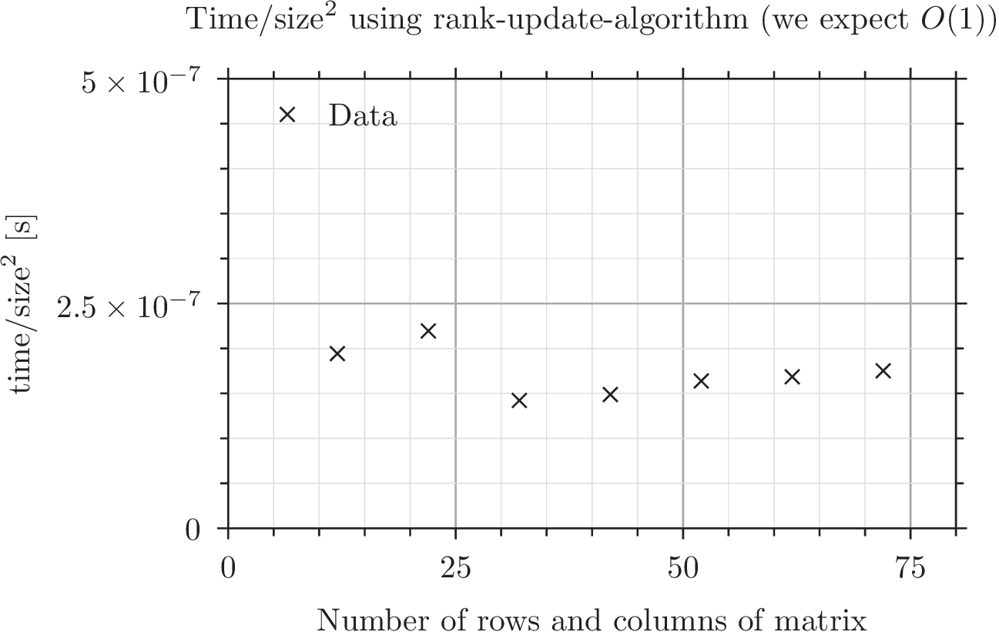

# EXAM IN PRACTICAL PROGRAMMING AND NUMERICAL METHODS
Michael Iversen (201505099)

This folder contains my solution to exam question 7: Symmetric rank-1 update of a size-n symmetric eigenvalue problem.
The core methods are located in main.cs while the remaining .cs files contain various helper scripts.

## Content of main.cs
#### find_eigenvalues
This method implements the algorithm for finding eigenvalues after a rank-1 update in O(n^2) operations.
The method works by finding the roots of the secular equation.

#### root_finding
This method finds a root of a function in an interval [x_min, x_max].
The method uses the Newton-Raphson algortihm with back-tracking line search.

#### test_code
This method tests the "find_eigenvalues" method by comparing the output of this method with the Jacobi eigenvalue algortihm implemented in homework "eigenvalues".
We test the diagonalization of random matrices of various sizes and some special cases (a negative sigma value, trivial u vector, matrix D with degenerate eigenvalues).

#### measure_performance
This method measures the performance of the rank-1 update algortihm by measuring the ellapsed time for different matrix sizes. 
The data is plotted in figures rank1_performance1.png and rank1_performance2.png.
For comparison, the method also measures the performance of the Jacobi eigenvalue algortihm with data plotted in figures jacobi_performance1.png and jacobi_performance2.png.

#### get_random_rank1_update
This is a helper method used in testing. 
The method returns a random diagonal matrix "D", a random vector "u" and a random double "sigma".
The matrix we wish to diagonalize is then given by A = D + sigma*u*u^T.

## Performance test
### rank1_performance1.png
We measure the ellapsed time when diagonalizing matrices of 8 different sizes.
The time as a function of matrix size is illustrated in the figure.
We expect the algortihm to be O(n^2), i.e. time ~ size^2.
    
#### rank1_performance2.png
In rank1_performance1.png we expect the behaviour time ~ size^2.
However, the exact behaviour was difficult to jugde from that figure.
In this figure we instead plot time/size^2 as a function size, since this should be constant when time ~ size^2.
We see that the data is approximately constant and we conclude that the algortihm is of computational complexity O(n^2).

#### jacobi_performance1.png
We compare the rank-1 update algortihm with the Jacobi eigenvalue algortihm.
The Jacobi eigenvalue algorithm has complexity O(n^3) and we generally see that the algortihm is much slower than the rank-1 update algortihm.

#### jacobi_performance2.png
Similar to rank1_performance2.png, we plot time/size^2 as a funtion of size to determine whether time ~ size^3.
Since this plot is approximately a straight line, we conclude that the Jacobi eigenvalue algortihm is of complexity O(n^3).
        
In total, the rank-1 update algortihm has complexity O(n^2) and is generally much faster than the Jacobi eigenvalue algorithm.
